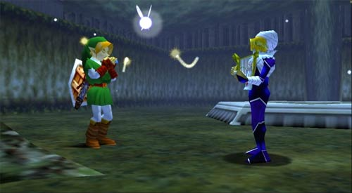
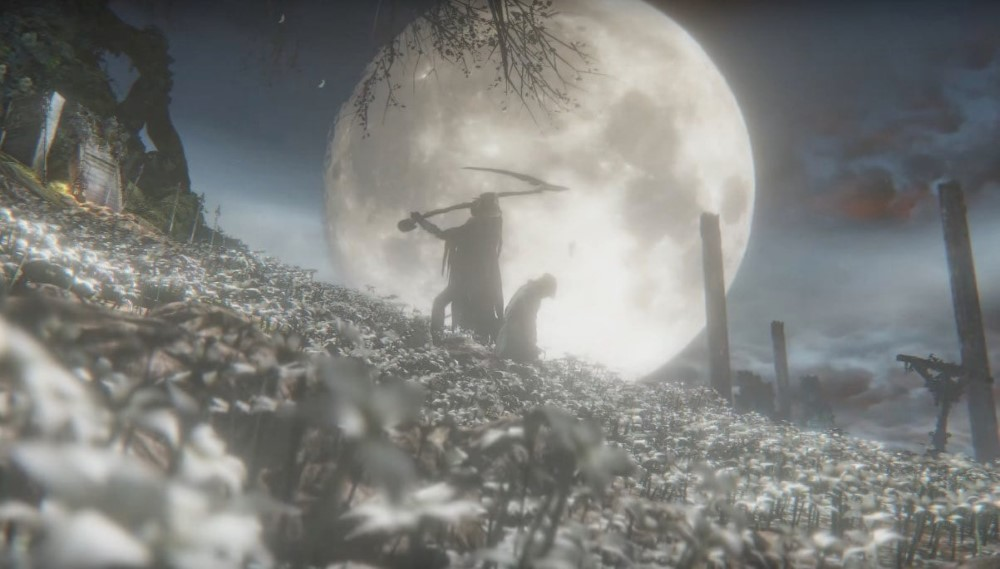

# 🎮 Gaming Profile

 

## 🚀 **My Steam Status**

 

---

## 🎯 **Video Games**

 

🎮 <strong>Game:</strong> The Legend of Zelda: Ocarina of Time 
🏆 <strong>Achievement Unlocked:</strong> Hylia's Chosen Hero

 

 

> ### *"The flow of time is always cruel... its speed seems different for each person, but no one can change it... A thing that does not change with time is a memory of younger days..."* 
> ### — **Sheik**

 

---

 

🎮 <strong>Game:</strong> Bloodborne 
🏆 <strong>Achievement Unlocked:</strong> Cerebrum Unbound

 

 

> ### *"I no longer dream, but I was once a hunter too. There's nothing more horrific than a hunt. In case you fail to realise, the things you hunt -- they're not beasts, they're people. One day you will see.."* 
> ### — **The Retired Hunter, Djura**

 

---

---

## 📊 **My "Games I've Played" Spreadsheet!**

 

In a moment of extreme boredom, I decided to create a spreadsheet to keep track of all the games I've played. It's a work in progress, but you can check it out here:

**[📋 Games I've Played!](https://docs.google.com/spreadsheets/d/1fwxwG5y6yAuFv6S6gYLs0oDLWLBuBD9jPyFWmWXazs8/edit?usp=sharing)**

 

---

## 🖥️ **My Gaming Setup!**

 

### 🔧 **Hardware:**

| Component | Specification |
|-----------|---------------|
| **CPU** | [AMD Ryzen 5 5500](https://www.amd.com/en/products/cpu/amd-ryzen-5-5500) |
| **GPU** | [NVIDIA GeForce RTX 4060 8GB](https://www.nvidia.com/en-us/geforce/graphics-cards/40-series/rtx-4060/) |
| **RAM** | [16GB DDR4](https://www.crucial.com/memory/ddr4) |
| **Storage** | [1TB NVMe SSD](https://www.samsung.com/semiconductor/minisite/ssd/product/consumer/970evo/) |
| **Storage** | 2TB HDD (Harvested from old PC) |
| **Storage** | 3TB HDD (Harvested from old PC) |
| **Motherboard** | [Gigabyte B550M K](https://www.gigabyte.com/Motherboard/B550M-K-rev-10#kf) |
| **Power Supply** | [650W 80+ Bronze](https://www.novatech.co.uk/products/corsair-cx-series-cx650-650w-80-plus-bronze-atx-power-supply/cp-9020278-uk.html) |

### 🖱️ **Peripherals:**

| Device | Specification |
|--------|---------------|
| **Monitor** | [23.8" 165Hz 1080p](https://www.amazon.co.uk/ASUS-Gaming-1080P-Monitor-VG247Q1A/dp/B0997NRZ3F/ref=asc_df_B0997NRZ3F?mcid=5fdc820613783aa99c8f21e99f59d57c&hvocijid=6371826395334187326-B0997NRZ3F-&hvexpln=74&tag=googshopuk-21&linkCode=df0&hvadid=696285193871&hvpos=&hvnetw=g&hvrand=6371826395334187326&hvpone=&hvptwo=&hvqmt=&hvdev=c&hvdvcmdl=&hvlocint=&hvlocphy=9046506&hvtargid=pla-2281435176618&gad_source=1&th=1) |
| **Monitor** | 19" 1080p 75Hz (FB Marketplace find) |
| **Mouse** | [Glorious Model O-](https://www.amazon.co.uk/Glorious-PC-Gaming-Race-Gaming-Maus/dp/B07VMM5LKH/ref=asc_df_B07VMM5LKH?mcid=b0e0414e952538c99505b17e46b0abfe&hvocijid=16967873701500563631-B07VMM5LKH-&hvexpln=74&tag=googshopuk-21&linkCode=df0&hvadid=696285193871&hvpos=&hvnetw=g&hvrand=16967873701500563631&hvpone=&hvptwo=&hvqmt=&hvdev=c&hvdvcmdl=&hvlocint=&hvlocphy=9046506&hvtargid=pla-2281435176938&gad_source=1&th=1) |
| **Headset** | [Razer Kraken Kitty V2 BT](https://www.razer.com/gaming-headsets/razer-kraken-kitty-v2) |

### 🎮 **Consoles:**

- **Nintendo Switch 2** 
- **Wii U**
- **New Nintendo 2DS XL: Pikachu Edition**
- **Nintendo Wii**
- **[FPGBC (Funny Playing Game-Boy Colour)](https://funnyplaying.com/products/fpgbc-kit)**

 

---
---

# 👨‍💻 **About my actual code!**

 

### 🎓 **Education & Skills**

I am a college student in England doing a [T-Level](https://www.tlevels.gov.uk/students/subjects/digital-production-design-development) course in Digital Production, Design and Development. I have a strong grip on Python and am in the midst of learning quite a few other languages and frameworks, including:

#### 🔧 **Languages & Frameworks:**
- **TypeScript** ([Svelte](https://svelte.dev/))
- **C#** ([ASP .NET Core](https://dotnet.microsoft.com/en-us/apps/aspnet))
- **Go** ([Golang](https://golang.org/), [Gin](https://gin-gonic.com/))
- **C** ([Game decompilation](https://zelda.deco.mp))
- **C++** ([Game decompilation](https://zelda.deco.mp))

 

### 🎮 **Game Development & Reverse Engineering**

I also have a keen interest in game development and reverse engineering, I consistently keep an eye on the progress of game decompilation, recompilation and modding projects, such as:

#### 📦 **Projects I Follow:**
- **[Ship of Harkinian](https://github.com/HarbourMasters/Shipwright)**
- **[Twilight Princess Decompilation](https://github.com/zeldaret/tp)**
- **[2Ship2Harkinian](https://github.com/HarbourMasters/2ship2harkinian)**

#### 🌟 **Most Exciting Project:**
But for sure out of all of these, the most exciting and promising is the Wiseguy [N64 static recompilation project](https://github.com/N64Recomp/N64Recomp), which is a project that aims to decompile and recompile N64 games into C code, allowing for easier modding and porting of these games to modern platforms. The code isn't understandable after the recompilation, but it is a step in the right direction for N64 modding and porting. For games that use very specific microcodes that aren't understood yet, the game can run in NLE mode. The project uses Dario's [RT64](https://github.com/rt64/rt64) renderer to deliver improvements such as high framrates.

 

### 👥 **Team Development**

I am very passionate about game development but also software development in general! Within my T-Level course, I have been working alongside some very talented people within my class to create software and games. We have an organisation called [Aucheri](https://github.com/Aucheri) where we post just some of our projects (some are private, so not all of our projects are there). 

#### 🚀 **My Role:**
We work together very well and have a lot of fun doing it! Within the group, my part is mainly focused on API's and backend development, but I also do some frontend work. My dedication to mostly Golang at the moment makes me the most efficient at API's, though. So that's mostly my part! I am starting to get much better at understanding the quirks of HTTP and Cookies.

