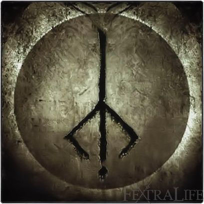

# 🎮 Gaming Profile

 

## 🚀 **My Steam Status**

 

---

## 🎯 **Video Games**

 

🮠<strong>Game:</strong> The Legend of Zelda: Ocarina of Time 
🏆 <strong>Achievement Unlocked:</strong> Hylia's Chosen Hero

 

 

> ### *"The flow of time is always cruel... its speed seems different for each person, but no one can change it... A thing that does not change with time is a memory of younger days..."* 
> ### — **Sheik**

 

---

 

🮠<strong>Game:</strong> Bloodborne 
🏆 <strong>Achievement Unlocked:</strong> Cerebrum Unbound

 

 

> ### *"I no longer dream, but I was once a hunter too. There's nothing more horrific than a hunt. In case you fail to realise, the things you hunt -- they're not beasts, they're people. One day you will see.."* 
> ### — **The Retired Hunter, Djura**
